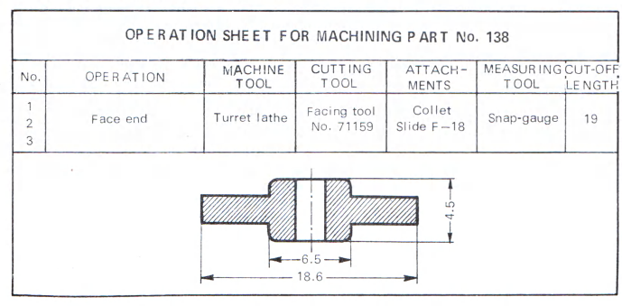
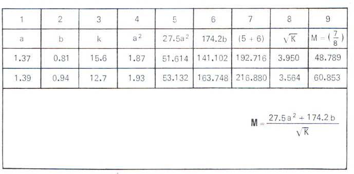
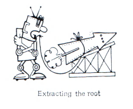

+++
word: Algorithm
definition: A rule defining the content and sequence of operations for solving a recurrent mathematical problem
tagline: Rules for All
+++

An air of excitement filled the
Italian town of Bologna on the 12th
of February, 1535, with mathematicians, nimble number experts and
lovers of contests of all kinds flocking to it from all over Italy and
even some other countries of Medieval Europe. The occasion was the
opening of a mathematical tournament, one of the features of which
was, it had been announced, a challenge by a mathematician by the
name of Fiore to compete with him
in the art of solving cubic equations.
The one who solved the greater number of problems put forward by the
other would be declared the winner.

Fiore’s challenge was accepted by
one Niccolo Tartaglia, an obscure
teacher of mathematics. He won the
contest, having solved all the 30
problems offered him by Fiore &mdash; who
was unable to solve a single one of
Tartaglia’s!

How was Niccolo Tartaglia able
to gain such a brilliant victory,
which left none in doubt as to who
was the better man? The answer to
this question is to be found in events
that preceded the tournament.

Ten years or so earlier Scipio del
Ferro, professor of mathematics at
the university of Bologna, had died.
Shortly before his death he had discovered a general method of solving
an extremely difficult problem, thus
crowning the work of many years.
The only person he had informed of
this had been Anabello della Nove,
his son-in-law and successor at the
university. By some devious ways,
however, the secret reached Fiore.
With a rule for solving a problem
which had defied the Arabs, Greeks,
and scholars of Medieval Europe in
his hands, Fiore decided that he
could challenge the mathematicians
of the world.

His hopes, however, were dashed
when Tartaglia responded to his challenge. Tartaglia, a mathematical genius, was confident that he would
easily beat Fiore, but ten days before the contest he learned that Fiore
was in possession of the late Scipio
Ferro’s method. Undaunted, Tartaglia got down to work and within those
few days came up with a better method which enabled him to triumph brilliantly at the contest.

Tartaglia’s algorithm, later perfected by the Italian mathematician
Girolamo Cardano, survives to this
day as a general solution of cubic
equations.

## So what is an algorithm? What is this universal too! for solving problems?

END COLLUMNS

The simplest mathematical operation is addition. It can be carried out without
any understanding of how it works, simply by obeying certain rules best exemplified by the use of the abacus:

“Move to the right the number of beads corresponding to the number of units
of the first figure. Then move to the right the number of beads equal to the number of units of the second figure. Count the total number of beads for the requisite sum.”

Using these rules a first-former at school can add one-digit numbers with the
help of an abacus. Only in mathematics instead of “rule” they say “algorithm”.
If a problem is likened to a lock, then the algorithm for its solution is the key.

Algorithms are needed to solve diverse problems. Mathematics cannot get
along without a technology of its own&mdash;a technology of problem-solving.

The solution of the most difficult problem can be broken down into a number
of simple operations, a sequence of elementary steps. They are described by an
algorithm.

Thus, an algorithm is a precise instruction for solving a class of problems by
means of a series of simple operations. In other words, it is a manual for problemsolving. It can be drawn up as a series of concise instructions to be carried out
exactly and to the dot. An algorithm is a faithful guide that shows the road to
be followed to solve a problem.

A good example is Euclid’s Algorithm for determining the greatest common
divisor of any two numbers $a$ and $b$. It consists of five instructions:

1. Inspect the two numbers $a$ and $b$. Proceed to next instruction.
2. Compare the numbers ($a$ equals $b$, or $a$ is less than $b$, or $a$ is greater than $b$). Proceed to next instruction:
3. If $a$ equals $b$, this number is the greatest common divisor. If $a$ is not equal to $b$, proceed to next instruction.
4. If $a$ is smaller than $b$, change their places. Proceed to next instruction.
5. Subtract $b$ from $a$. Inspect the subtrahend and the remainder. Proceed to instruction 2.

Thus, after carrying out all the instructions, one must return to the second,
then the third, fourth, and so on, until the numbers are equal. Then the job is
done. Try and find the greatest common divisor of, say, 24 and 14, using these
instructions.

START COLUMNS

Speaking of algorithms brings to mind a joke probably thought up by mathematicians.

One mathematician was asked whether he could cook a soup, to which he responded:

"First I must formulate the problem. Given: a pot, a gas cooker, a
quart of water and a package of dehydrated soup. Required: to cook the
soup. The problem can be solved by
means of a certain algorithm $z$: pour
the water into the pot; place the pot
on the cooker; light the gas. When
the water boils, add the dehydrated
soup; ten minutes later turn off the
gas.”

“What if the pot is already on
the cooker?”

“This introduces a complication,
but the problem remains solvable.
In this case the algorithm $z$, must
be carried out: switch off the gas,
remove the pot from the cooker; pour
out the water. The new problem has
thus been reduced to the old one,
which I know how to solve. Hence, the
new one can be solved, and | can
cook the soup even if the pot is already warming on the fire.”

You may well ask whether it’s
worth wasting one’s time on such a
cumbersome set of instructions to determine the greatest common divisor
of two simple numbers. Perhaps not.
But there are other, more complex
problems, and solving them requires
knowledge of an appropriate algorithm and how to use it.

As a guide to action every algorithm
must meet certain requirements. Thus,
it must be applicable not for the solution of just one problem, but of
all problems of a given type. Its
use as a guide to action would be
just about nil if it could be used
only for one pair of numbers such as
21 and 14.

Discovering and formulating an algorithm requires extensive knowledge
and much hard creative work. But
when the algorithm has been found
and the problem’s solution broken
down into an ordered sequence of
precisely defined operations, all that
remains is to faithfully carry out the
instructions. Anyone can do this working almost mechanically.

Mechanically? But if that’s the
case, can’t the work be entrusted to
a machine?

It can, and electronic computers
are the answer. Nowadays scientists
have learned to automate the solution of any problem for which an
algorithm exists.

The elaboration of algorithms specifically suited for problem-solving
by machine is of primary importance
in our computer age. Algorithms are
of prime importance in computer mathematics&mdash;in fact, they are computer mathematics.

The greater the advances of computer mathematics and the more widespread the use of computers in all
spheres of life the more important is
the task of discovering algorithms for
solving large series of problems. With
such an algorithm a computer can be
programmed so that it can solve any
or all of the problems of the series,
as the case may require. The importance of comprehensive algorithms is
enhanced by the fact that computers
calculate very swiftly and in time
will work even faster. It is better
to discover a general method of solving a large number of similar problems, leaving the actual
calculations to computer, than to work out a solution for every problem, to be calculated with or
without a computer.

